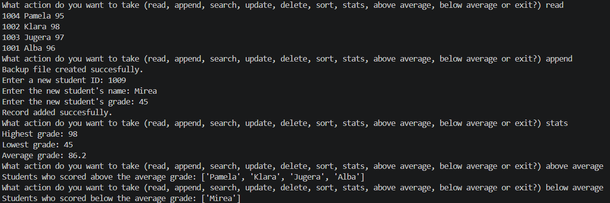
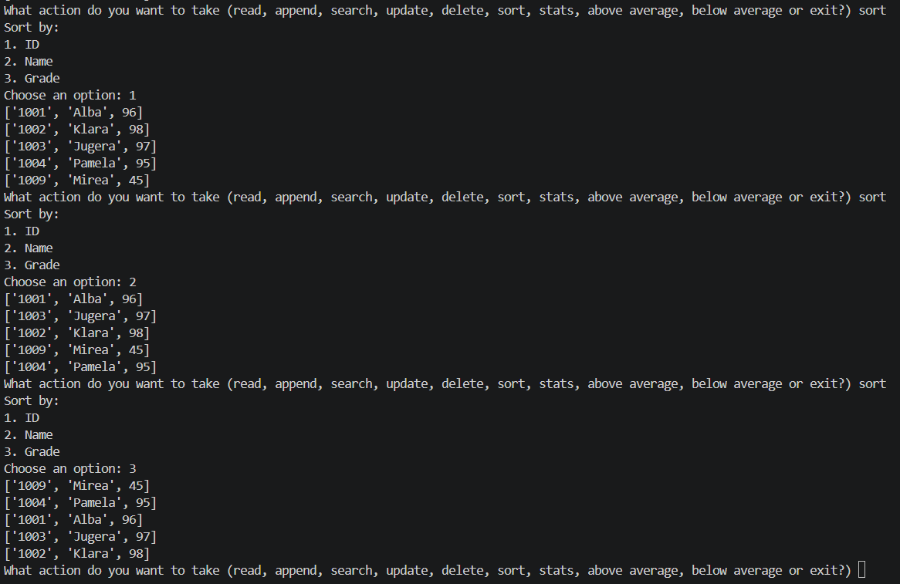
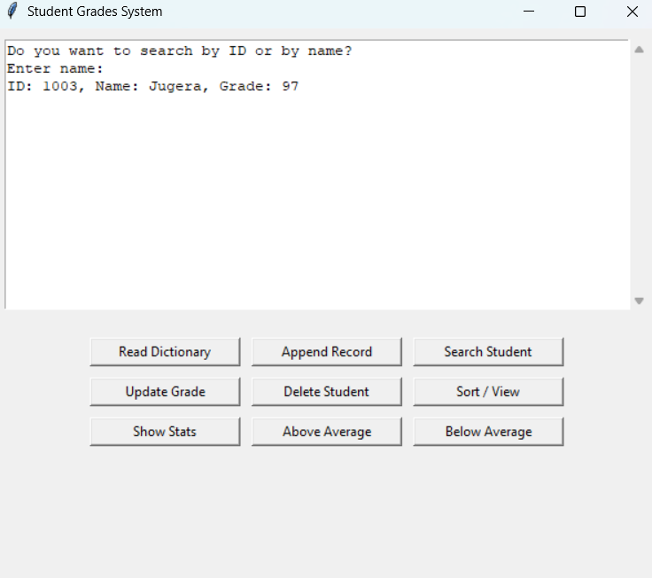
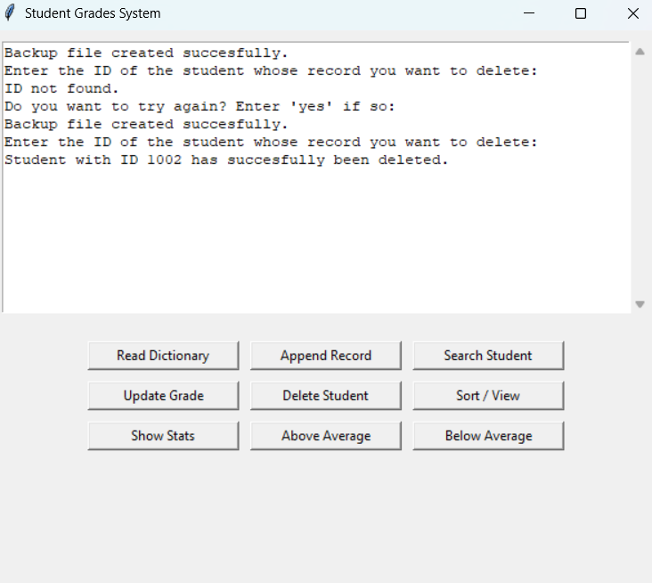

# Student Grade Management System

## Description

This project is a Student Grade Management System developed in Python. It allows users to manage student records stored in a text file. The program can add new students, search for existing records, update grades, delete records, sort data, and calculate basic statistics.

Student information is stored in a file named `grades.txt` and loaded into a dictionary for processing. A backup file is also created before making changes to help prevent accidental data loss.

## Features

The application supports:

- Adding new student records
- Viewing all student records
- Searching for students by ID or name
- Updating student grades
- Deleting student records
- Sorting records by ID, name, or grade
- Calculating the highest, lowest, and average grade
- Displaying students who scored above or below the average
- Creating backup copies of the data file

## Files

- `main.py` – contains the program source code
- `grades.txt` – stores student records
- `backup_grades.txt` – backup copy of the records
- `README.md` – project documentation

## Data Storage

Student records are stored in the following format:

```text
1001, John Smith, 85
1002, Sarah Johnson, 92
1003, Michael Brown, 78
```

The program loads these records into a dictionary structure, making it easier to search, update, and process data.

## Screenshots





## How It Works

When the program starts, it reads the student records from the text file. The user can then choose different actions such as adding, searching, updating, or deleting records. Any changes made are saved back to the file. The program continues running until the user chooses to exit.

## Requirements

- Python 3.x
- No external libraries are required

## Alternative GUI Version

An additional version of this project was created with a graphical user interface (GUI). It provides the same functionality as the console-based version while offering a more user-friendly experience.

The GUI version was developed with the assistance of Artificial Intelligence tools for the interface design and implementation, while maintaining the same core logic and functionality as the original application.

## Conclusion

This project demonstrates the use of Python dictionaries, file handling, functions, and basic data processing techniques to create a simple student record management system.
